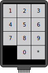
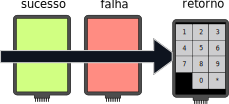
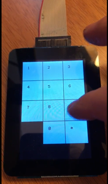
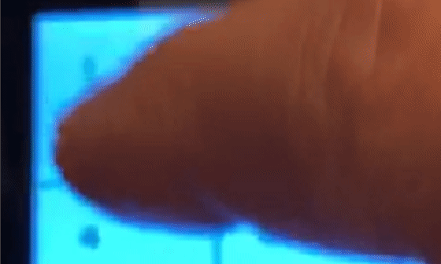
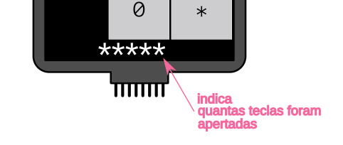
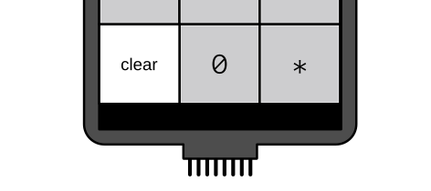

# 2020a - Avaliação prática 2

São 3 Avaliações práticas, onde a nota final é a média
entre as duas maiores notas, a pior é descartada.

Começando:

1. Atualize o arquivo `ALUNO.json` com seu nome e e-mail e faça um commit imediatamente.

**Faça o seu trabalho de maneira ética! Você não deve trocar informações com os seus colegas!**

- **A cada 30 minutos você deverá fazer um commit no seu código!**
    - Códigos que não tiverem commit a cada 30min ou que mudarem drasticamente entre os commits serão descartados (conceito I) !!
    - Você deve inserir mensagens condizentes nos commits!
- Duração: 3h
- **Usar como base o seu código do lab [lab RTOS LCD](https://insper.github.io/ComputacaoEmbarcada/Lab-7-RTOS-LCD/) (copiar para o repositório!)**

:triangular_flag_on_post: **Ao finalizar a entrega preencher o formulário (uma única vez!):**

- https://forms.gle/6ytA3AExrDJdBhYK6

## Descrição

Nessa avaliação iremos trabalhar com o LCD max Touch e iremos desenvolver uma fechadura eletrônica! 



Essa fechadura eletrônica terá a principio uma senha fixa e pré definida, mas que poderá ser alterada nos conceitos B e A. A senha padrão da fechadura possui 4 dígitos e é: `1`, `5`, `9`, `0`:

```c
#define PASS_SIZE 4
char pass[PASS_SIZE] = { '1', '5', '9', '0'};
```

O sistema deve esperar o usuário pressionar o botão `*` para validar a senha. Se a senha for válida, deve exibir uma tela verde e uma vermelha para uma senha inválida, depois de um instante o programa deve voltar para a tela original, permitindo o usuário testar uma senha nova.



O vídeo a seguir demonstra o projeto funcionando

[](http://54.162.111.146/shared/embarcados/av2.mp4)

- http://54.162.111.146/shared/embarcados/av2.mp4

Para facilitar o desenvolvimento da interface, **a distribuição dos botões já foram fornecidas** e estão no arquivo [`botoes.h`](botoes.h), dentro desse repositório. 

A seguir um exemplo da primeira fileira de botões (`1`, `2`, `3`):

```c
t_but but1 = {.width = BUT_SIZE, .height = BUT_SIZE,  
              .colorOn = COLOR_GRAY, .colorOff = COLOR_GRAY,
              .x = 1*BUT_SPACE + BUT_SIZE/2, .y = BUT_SPACE+ BUT_SIZE/2, 
              .status = 0};
t_but but2 = {.width = BUT_SIZE, .height = BUT_SIZE,
              .colorOn = COLOR_GRAY, .colorOff = COLOR_GRAY,
              .x = 2*BUT_SPACE + BUT_SIZE/2 + BUT_SIZE, .y = BUT_SPACE + BUT_SIZE/2,
              .status = 0};
t_but but3 = {.width = BUT_SIZE, .height = BUT_SIZE,
              .colorOn = COLOR_GRAY, .colorOff = COLOR_GRAY,
              .x = 3*BUT_SPACE + BUT_SIZE/2 + BUT_SIZE*2, .y = BUT_SPACE + BUT_SIZE/2,
              .status = 0};
```

É utilizado a struct do Lab do LCD:

```c
typedef struct {
    uint32_t width;     // largura (px)
    uint32_t height;    // altura  (px)
    uint32_t colorOn;   // cor do botão acionado
    uint32_t colorOff;  // cor do botão desligado
    uint32_t x;         // posicao x 
    uint32_t y;         // posicao y
    uint8_t status;
  } t_but;
```

**Você deve usar como base o seu código do lab [lab RTOS LCD](https://insper.github.io/ComputacaoEmbarcada/Lab-7-RTOS-LCD/), copiando para o repositório da avaliação!!**

## Rubrica

Vocês devem gravar um vídeo do firmware funcionando na placa para submeter o projeto.

:triangular_flag_on_post: **Ao finalizar a entrega preencher o formulário (uma única vez!):**

- https://forms.gle/6ytA3AExrDJdBhYK6

### C

- Exibir os botões no LCD
- Exibir os números nos botões
  - dica: use a função `ili9488_draw_string`
- Armazenar temporariamente a senha digitada
- Sempre que o botão `*` for apertado, validar a senha
- Exibir fundo verde quando senha correta
- Exibir fundo vermelho quando senha incorreta
- A interface volta ao início permitindo que o usuário digite a senha novamente

### B

- **Qualidade:** Adiciona campo com nome dos botões no struct `t_but`, função que desenha botões já escreve o seu número

- **Feedback:** Faz com que o botão mude de cor quando apertado e volte ao original após alguns ms.
  - dica: utilize a cor `COLOR_DARKGRAY`
    
  
    
- **Contagem:** Exibe em baixo do LCD um `*` para cada tecla apertada
    


- **Clear:** Adiciona botão de clear que limpa a senha digitada
    


## A

- **TimeOut:** reiniciar a senha se ficar 5 segundos sem que o usuário aperte uma nova tecla.

- **Erros:** Após 3 tentativas erradas bloqueia a tela no vermelho por 15 segundos. Próxima vez que acontecer outras 3 tentativas erradas, bloqueia tela por 30 segundos.

- **Nova senha:** Primeira sequência digitada após o reset define a nova senha.
    - tamanho não é limitado em **4**
    - se usuário apertar `clear` permite digitar a senha novamente
    - no lugar de `*` exibe a senha
    - armazena senha após apertar `*`
